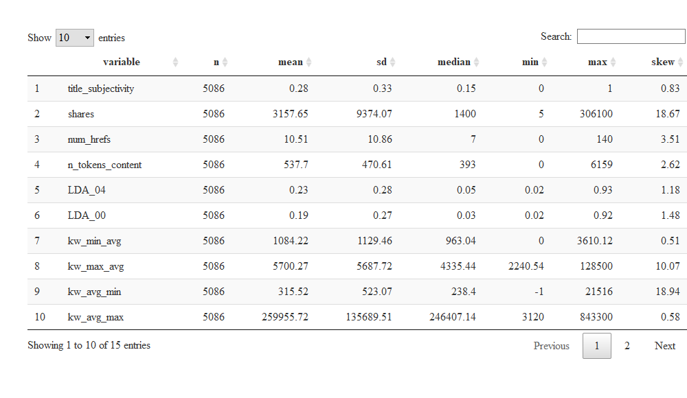
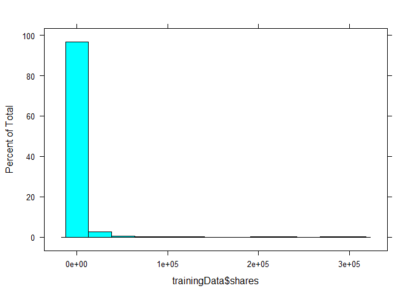
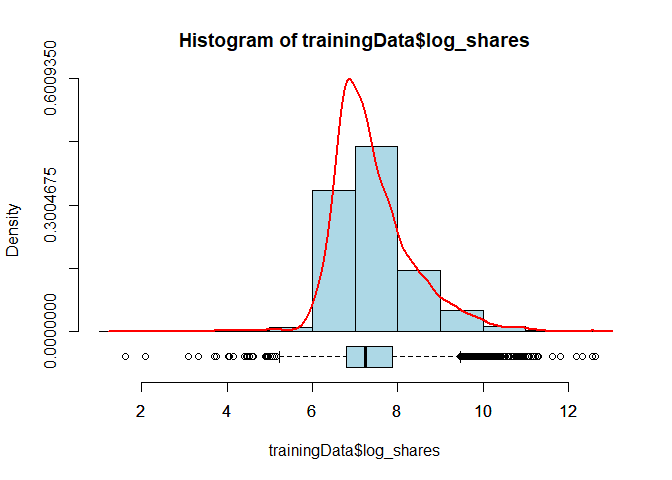

Weekday Analysis
================
Zack Vaskalis
07/03/2020

  - [Weekday Analysis for:](#weekday-analysis-for)
  - [Introduction](#introduction)
      - [Information on Variables for
        Analysis:](#information-on-variables-for-analysis)
      - [Purpose of the Analysis](#purpose-of-the-analysis)
      - [Methods for Analysis](#methods-for-analysis)
          - [Multiple-Linear Regression (MLR)
            Model](#multiple-linear-regression-mlr-model)
          - [Random Forest (RF) Model](#random-forest-rf-model)
  - [Data](#data)
  - [Summarizations](#summarizations)
  - [Modeling](#modeling)
      - [Linear: Multiple Linear Regression
        Model](#linear-multiple-linear-regression-model)
      - [Non-Linear: Random Forest
        Model](#non-linear-random-forest-model)

## Weekday Analysis for:

    ## [1] "Thursday"

## Introduction

This project uses, for analysis, the Online News Popularity Data Set
which can be found at the University of California Irvine [UCI Machine
Learning Repository, Center for Machine Learning and Intelligent
Systems](https://archive.ics.uci.edu/ml/datasets/Online+News+Popularity#).
The dataset being used here was compiled by several researchers in
Portugal, who collected articles from [Mashable](www.mashable.com) and
compiled associated statistics for a period of two years, with the goal
of being able to predict the number of shares in social networks (a
measure of popularity). The dataset has over 39,000 records of
information spanning the two year time period from January 07, 2013 to
December 27th, 2014. The dataset also contains 61 variables, of which 58
are predictive attributes, 2 non-predictive variables(the source url and
the time between article publication and dataset acquisition), and
finally the goal field for prediction: the number of shares.

### Information on Variables for Analysis:

Out of the 61 Attributes available in this dataset for analysis, in
order not to overfit the model with too many dependent variables (which
could yield not enough generalization of the dataset to make
predictions, especially valid ones), I have chosen to use the following
14 predictor variables and of course the 1 outcome variable we are
trying to predict, `shares`. The weekday variables are also included,
but only for subsetting the data by the day of the week. Once we have
the “Monday” dataset, for instance, all of these `weekday_is_*`
variables will be removed from the dataset. The variables selected are
below, and the reasoning behind their selection follows.

Attribute Information:  
1\. `n_tokens_content`: Number of words in the content  
2\. `num_hrefs`: Number of links  
3\. `average_token_length`: Average length of the words in the content  
4\. `kw_avg_min`: Worst keyword (avg. shares)  
5\. `kw_avg_max`: Best keyword (avg. shares)  
6\. `kw_min_avg`: Avg. keyword (min. shares)  
7\. `kw_max_avg`: Avg. keyword (max. shares)  
8\. `kw_avg_avg`: Avg. keyword (avg. shares)  
9\. `LDA_00`: Closeness to LDA topic 0  
10\. `LDA_04`: Closeness to LDA topic 4  
11\. `global_subjectivity`: Text subjectivity  
12\. `global_sentiment_polarity`: Text sentiment polarity  
13\. `title_subjectivity`: Title subjectivity  
14\. `abs_title_subjectivity`: Absolute subjectivity level  
15\. `shares`: Number of shares (target outcome trying to predict)  
16\. `weekday_is_variables`: Was the article published on a
\_\_\_\_\_\_\_?

  - `weekday_is_monday`: Was the article published on a Monday?  
  - `weekday_is_tuesday`: Was the article published on a Tuesday?  
  - `weekday_is_wednesday`: Was the article published on a Wednesday?  
  - `weekday_is_thursday`: Was the article published on a Thursday?  
  - `weekday_is_friday`: Was the article published on a Friday?  
  - `weekday_is_saturday`: Was the article published on a Saturday?  
  - `weekday_is_sunday`: Was the article published on a Sunday?

For this dataset of nearly 60 predictor variables, a dataset for
analysis that contains approximately 25% of them seems to feel right,
since too many predictor variables can cause overfitting. This subset of
variables is a sampling across the set of variables I thought might have
an impact. For example, the number of words of content
(`n_tokens_content`), and the number of links (`num_hrefs`) seemed
reasonable that they might play a role in predicting shares. The `kw_`
variables also seem like they should be good predictors. I chose the
first and last `LDA` variables. The global ratings also seemed like they
would have an impact on predicting the shares so I chose
`global_subjectivity` and `global_sentiment_polarity`. Then finally, to
round out the dataset of predictors I chose the title subjectivity and
absolutely subjectivity level, since often a title will have the largest
impact - catchy or provoking titles are clickbait for a reason\!

### Purpose of the Analysis

The ultimate purpose of this analysis is to create 2 models (one linear
and one non-linear) for predicting the shares variable, which is in some
sense is a measure of popularity. In addition to this purpose, another
primary purpose is to explore using parameter functionality within R
Markdown to automatically generate analysis reports for each day of the
week, using each `weekday_is_` variable as a parameter.

### Methods for Analysis

As mentioned above, there will be 2 models created within this project,
one linear and one non-linear.

#### Multiple-Linear Regression (MLR) Model

The linear model we will use for our 14 predictor variables will be a
multiple linear regression model, without interactions or quadratic
terms. This is in part why the datasets being used for training and
testing only contain the variables we need for analysis - which will
simplify the code as we will see below. This model also allows us to use
the root mean squared error (RMSE), which is an important topic in
statistics in general. Karen Grace-Martin has a nice description of RMSE
in a succinct blog post titled: [Assessing the Fit of Regression
Models](https://www.theanalysisfactor.com/assessing-the-fit-of-regression-models/#:~:text=The%20RMSE%20is%20the%20square,an%20absolute%20measure%20of%20fit).
The RMSE is the square root of the variance of the residuals. It
indicates the absolute fit of the model to the data–how close the
observed data points are to the model’s predicted values. This is
exactly what we are trying to do here. We will look at the RMSE of both
the training data and testing data. What is nice about the RMSE, is that
we will use this as the measure of the non-linear model as well, and in
some sense be able to compare the two models that way. RMSE is also an
absolute measure of fit, since it is the square root of a variance, it
can also be interpreted as the standard deviation of the unexplained
variance, and has the useful property of being in the same units as the
response variable. Lower values of RMSE indicate better fit. RMSE is a
good measure of how accurately the model predicts the response, and it
is the most important criterion for fit if the main purpose of the model
is prediction, which again, is exactly what we are trying to do here.

#### Random Forest (RF) Model

For the non-linear model, we will use the random forest model. Tony Yiu
has a great blog post entitled [Understanding Random Forest: How the
Algorithm Works and Why it Is So
Effective](https://towardsdatascience.com/understanding-random-forest-58381e0602d2).
One benefit in this situation to use the Random Forest Model is that we
can again in some sense compare to the MLR model via RMSE. The main
concept and benefit behind the RF Model in general is that there is
wisdom in the group, i.e. a large number of relatively uncorrelated
models (trees) operating as a committee will outperform any of the
individual constituent models. This is because the trees protect each
other from their individual errors, as long as they are all not in
error. A few trees may be wrong, but many many more will be right, so
the group leads the model in the correct direction. Thus, we will use
these two models for our analysis and compare the results for each day
of the week.

## Data

Now on to the data\! First we will load in all of the necessary packages
from R.

``` r
#load necessary libraries
library(rmarkdown)
library(tidyverse)
library(caret)
library(lattice)
library(ggplot2)
library(dplyr)
library(haven)
library(rgl)
library(knitr)
library(tree)
library(randomForest)
library(psych)
library(DT)
library(summarytools)
library(packHV)
library(pacman)
```

Next, we will read in the entire dataset. Then we will use the
`select()` function from the `dplyr` package to select only the
variables mentioned above for the analysis. After that we will start the
process for automation. We will filter by each day of the week for the
`weekday_is_` variable, thus ultimately creating 7 reports. Finally,
once the day of the week is selected, all of the `weekday_is_` variables
will be removed from the dataset, as they are no longer useful for the
analysis.

``` r
# Read-in entire dataset
path <- "C:/Users/Zachary Vaskalis/Dropbox/ST558/OnlineNewsPopularity.csv"
weekdayDataRAW <- read_csv(path)

# Select only variables I am choosing to use for the analysis.
weekdayData1 <- select(weekdayDataRAW, n_tokens_content, num_hrefs,
                       average_token_length, kw_avg_min, kw_avg_max,
                       kw_min_avg ,kw_max_avg, kw_avg_avg,
                       LDA_00, LDA_04,global_subjectivity,
                       global_sentiment_polarity, title_subjectivity,
                       abs_title_subjectivity, shares,
                       weekday_is_monday, weekday_is_tuesday,
                       weekday_is_wednesday, weekday_is_thursday, weekday_is_friday,
                       weekday_is_saturday, weekday_is_sunday)

# Select only the specific day of the week I am interested in from the passed parameter.
if (params$dayVar == "weekday_is_monday"){
  weekdayData2 <- filter(weekdayData1, weekday_is_monday == 1)
} else if (params$dayVar == "weekday_is_tuesday"){
  weekdayData2 <- filter(weekdayData1, weekday_is_tuesday == 1)
} else if (params$dayVar == "weekday_is_wednesday"){
  weekdayData2 <- filter(weekdayData1, weekday_is_wednesday == 1)
} else if (params$dayVar == "weekday_is_thursday"){
  weekdayData2 <- filter(weekdayData1, weekday_is_thursday == 1)
} else if (params$dayVar == "weekday_is_friday"){
  weekdayData2 <- filter(weekdayData1, weekday_is_friday == 1)
} else if (params$dayVar == "weekday_is_saturday"){
  weekdayData2 <- filter(weekdayData1, weekday_is_saturday == 1)
} else if (params$dayVar == "weekday_is_sunday"){
  weekdayData2 <- filter(weekdayData1, weekday_is_sunday == 1)
}

# Now we know we only have the day of the week filtered by above.
# So, we can remove all of the weekday_is_* variables now as they are no longer needed.
# Additionally, these variables are constant.  The selected weekday would contain all 1s,
# while the other weekdays are all 0s.  Thus, they are no longer useful for analysis.
weekdayData3 <- select(weekdayData2, -(weekday_is_monday:weekday_is_sunday))
```

After that is complete, we need to split the dataset into training and
testing partitions, using a 70%/30% approach. To do this we first
generate a random seed, shown in the code below by using the computer
clock `Sys.time()` function. Then that seed is used to randomly sample
the rows of the `weekdayData3` dataset, and take 70% of the data and put
it in the training dataset. The remaining 30%, found by using the dplyr
function `setdiff()` selects all the rows from `weekdayData3` not
already in the training dataset and puts them in the testing dataset.
The result of this code is that we have the two datasets we want:
`trainingData` and `testingData`.

``` r
# Get random number from the computer clock using Sys.time()
initial_seed <- Sys.time()
initial_seed <- as.integer(initial_seed)
print (initial_seed)
```

    ## [1] 1593823524

``` r
seed <- initial_seed %% 100000
#print(seed)

# -----------------RUN FROM HERE NOW THAT YOU HAVE RANDOM SEED-------------------------
# For reproducability, set seed using outcome of above process:
set.seed(42131)

# Get random sample of row numbers from large dataset to split data into train and test:
# 70% of data for training
train <- sample(1:nrow(weekdayData3), size = nrow(weekdayData3) * 0.70) 
# 30% of data for testing
test <- dplyr::setdiff(1:nrow(weekdayData3), train)

# Subset the Data into training and testing sets, using rows from train and test:
trainingData <- weekdayData3[train,]
testingData <- weekdayData3[test,]
```

## Summarizations

The summaries below are related to the training dataset. First we will
examine the variables in our training dataset numerically. The table
that appears below is a summary of some of the important statistics for
the variables from the training dataset using the `describeBy()`
function from the `psych` package. One important piece we see here is
the magnitude of the difference between the minimum and maximum for the
shares variable. Let’s investigate that using some summary plots.

``` r
# Summary statistics for all variables in the training dataset using the
# describeBy() function from the psych package
summaryData <- psych::describeBy(trainingData, trainingData$type)

displaySummary <- tibble(row.names(summaryData), summaryData) 
colnames(displaySummary)[1] <- "variable"
displaySummary[,4:12] <- round(displaySummary[,4:12], 2)
displaySummary2 <- select(displaySummary, 1, 3, 4, 5, 6, 9, 10, 12)
displayTable <- datatable(arrange(displaySummary2, desc(variable)))
displayTable
```

<!-- -->

So we saw how extreme the range is for the shares variable we are trying
to predict. Next we should probably investigate the distribution of
shares. To do that we can use a simple histogram. The code for the
histogram is below. Indeed, we see shares is a right-skewed (or
positively-skewed) distribution, with the majority of the distribution
to the left of the mean. This also should be evident, looking back at
the table above, you should notice a large positive value for skewness
on the shares variable. This makes shares the perfect candidate for a
logarithmic transformation. The standard log in R for transformations is
`log()` which represents the natural log, ln().

``` r
histogram(trainingData$shares)
```

<!-- -->

Now we can simply take the `log(shares)` and add it to the training
dataset using a new variable called `log_shares`. To make sure the log
transform worked on the data, let’s check the histogram for the
distribution of `log(shares)`. Let’s also calculate the min, max and
skewness of log(shares).

``` r
trainingData$log_shares <- log(trainingData$shares)
```

``` r
hist_boxplot(trainingData$log_shares, col = "lightblue", freq = FALSE, density = TRUE)
```

<!-- -->

``` r
min(trainingData$log_shares)
```

    ## [1] 1.609438

``` r
max(trainingData$log_shares)
```

    ## [1] 12.63167

``` r
skew(trainingData$log_shares)
```

    ## [1] 0.9405843

So hopefully by now it is apparent that the transformation worked quite
well. Now we should add `log_shares` to the testing dataset and remove
`shares` from both training and testing datasets.

``` r
# Add log_shares to testing dataset
testingData$log_shares <- log(testingData$shares)

# Remove shares from both training and testing datasets
trainingData <- select(trainingData, -(shares))
testingData <- select(testingData, -(shares))
```

Now we are ready to proceed with the analysis.

## Modeling

### Linear: Multiple Linear Regression Model

First we will start with the Multiple Linear Regression (MLR) Model. For
both analyses we will be using functions from the caret package,
specifically the `train()` function. For an MLR Model, we simply need to
add an option to the train() function with `method = "lm"`. We can also
add the root mean squared error (RMSE), which we discussed above, as an
option with the code `metric = "RMSE"`. We will also use 10-fold
Cross-Validation (CV). The results of the MLR Model are below. First we
run the model to fit using the training data. After we use the fitted
model on the test set. Finally we present the results of the training
and testing with RMSE values for each.

``` r
# Multiple Regression Model chosen using all predictor variables to try to predict log_shares.
# This will also allow for comparison to the random forest model, and RMSE values will be 
# compared between the two models.
trCtrl1 <- trainControl(method = "cv", number = 10)
fitMLR <- train(log_shares ~ ., data = trainingData, method = "lm", metric = "RMSE",
                trControl = trCtrl1, preProcess = c("center", "scale"))

#Summary of the MLR Model
fitMLR
```

    ## Linear Regression 
    ## 
    ## 5086 samples
    ##   14 predictor
    ## 
    ## Pre-processing: centered (14), scaled (14) 
    ## Resampling: Cross-Validated (10 fold) 
    ## Summary of sample sizes: 4577, 4577, 4577, 4578, 4578, 4577, ... 
    ## Resampling results:
    ## 
    ##   RMSE       Rsquared   MAE      
    ##   0.8806791  0.1050114  0.6509292
    ## 
    ## Tuning parameter 'intercept' was held constant at
    ##  a value of TRUE

``` r
fitMLR_RMSE <- fitMLR$results[[2]]
summary(fitMLR)
```

    ## 
    ## Call:
    ## lm(formula = .outcome ~ ., data = dat)
    ## 
    ## Residuals:
    ##     Min      1Q  Median      3Q     Max 
    ## -5.4418 -0.5532 -0.1480  0.4008  5.2895 
    ## 
    ## Coefficients:
    ##                            Estimate Std. Error t value
    ## (Intercept)                7.413343   0.012325 601.464
    ## n_tokens_content           0.004567   0.014366   0.318
    ## num_hrefs                  0.037945   0.014727   2.577
    ## average_token_length      -0.056818   0.016334  -3.479
    ## kw_avg_min                 0.045305   0.014822   3.057
    ## kw_avg_max                -0.098352   0.015987  -6.152
    ## kw_min_avg                -0.097195   0.016591  -5.858
    ## kw_max_avg                -0.350212   0.028860 -12.135
    ## kw_avg_avg                 0.592707   0.033510  17.687
    ## LDA_00                     0.084051   0.013354   6.294
    ## LDA_04                     0.097128   0.013414   7.241
    ## global_subjectivity        0.058496   0.016821   3.477
    ## global_sentiment_polarity -0.011187   0.013531  -0.827
    ## title_subjectivity         0.013231   0.014328   0.923
    ## abs_title_subjectivity     0.015996   0.014033   1.140
    ##                           Pr(>|t|)    
    ## (Intercept)                < 2e-16 ***
    ## n_tokens_content          0.750540    
    ## num_hrefs                 0.010006 *  
    ## average_token_length      0.000508 ***
    ## kw_avg_min                0.002250 ** 
    ## kw_avg_max                8.24e-10 ***
    ## kw_min_avg                4.97e-09 ***
    ## kw_max_avg                 < 2e-16 ***
    ## kw_avg_avg                 < 2e-16 ***
    ## LDA_00                    3.36e-10 ***
    ## LDA_04                    5.13e-13 ***
    ## global_subjectivity       0.000510 ***
    ## global_sentiment_polarity 0.408422    
    ## title_subjectivity        0.355823    
    ## abs_title_subjectivity    0.254397    
    ## ---
    ## Signif. codes:  
    ## 0 '***' 0.001 '**' 0.01 '*' 0.05 '.' 0.1 ' ' 1
    ## 
    ## Residual standard error: 0.879 on 5071 degrees of freedom
    ## Multiple R-squared:  0.1093, Adjusted R-squared:  0.1068 
    ## F-statistic: 44.45 on 14 and 5071 DF,  p-value: < 2.2e-16

``` r
# Now use MLR Model from training data to make predictions using testing data
predMLR <- predict(fitMLR, newdata = dplyr::select(testingData, -log_shares))

predMLR_RMSE <- sqrt(mean((predMLR-testingData$log_shares)^2))
predMLR_RMSE
```

    ## [1] 0.8596025

``` r
# Output the results of MLR Model
output1 <- tribble(~model, ~trainRMSE, ~testRMSE,
                   "MLR", fitMLR_RMSE, predMLR_RMSE)
output1
```

    ## # A tibble: 1 x 3
    ##   model trainRMSE testRMSE
    ##   <chr>     <dbl>    <dbl>
    ## 1 MLR       0.881    0.860

The logic behind choosing the multiple linear regression model is that
the shares (and equivalently the log-transformed log\_shares variable)
is a continuous numeric variable we are trying to predict, based upon
numerous dependent/explanatory variables. The full dataset has a total
of 58 predictors which is extremely large. Again the goal in mind here
to produce an accurate model with the least amount of error as possible
when making a prediction. At the same time, and this is the issue with
too many variables, we need to cognizant of not overfitting the model,
which occurs when there are too many variables in play and valid
predictions cannot be made.

### Non-Linear: Random Forest Model

The non-linear model chosen for this project is the random forests
model. This model is a good fit for this dataset given the number of
predictors included for analysis. In the model, a random subset of
predictors is selected, which will allow for a good predictor to not
dominate the tree fits. The model is run with 10-fold Cross Validation
(CV). The model is also specified with `ntree = 200` and `mtry =
ncol(trainingData)/3`. The results of the Random Forest Model are below.
First we run the model to fit using the training data. After we use the
fitted model on the test set. Finally we present the results of the
training and testing with RMSE values for each.

``` r
# Non-linear model chosen is Random Forests Model  
mtry <- ncol(trainingData)/3

# Fit Random Forest Tree using method = "rf" and tuning parameter, mtry
trCtrl2 <- trainControl(method = "cv", number = 10)
fitRandFrst <- train(log_shares ~ ., data = trainingData, method = "rf",
                     trControl = trCtrl2, preProcess = c("center", "scale"),
                     ntree = 200, tuneGrid = expand.grid(.mtry = mtry))

#Summary of the Random Forest Model
fitRandFrst
```

    ## Random Forest 
    ## 
    ## 5086 samples
    ##   14 predictor
    ## 
    ## Pre-processing: centered (14), scaled (14) 
    ## Resampling: Cross-Validated (10 fold) 
    ## Summary of sample sizes: 4577, 4577, 4578, 4579, 4576, 4578, ... 
    ## Resampling results:
    ## 
    ##   RMSE      Rsquared   MAE      
    ##   0.881481  0.1062411  0.6524083
    ## 
    ## Tuning parameter 'mtry' was held constant at a
    ##  value of 5

``` r
fitRF_RMSE <- min(fitRandFrst$results[2])

# Model predictions using testing data
predRandFrst <- predict(fitRandFrst, newdata = dplyr::select(testingData, -log_shares))

# Get the root mean squared error (RMSE) value - root of test prediction error
predRF_RMSE <- sqrt(mean((predRandFrst - testingData$log_shares)^2))
predRF_RMSE
```

    ## [1] 0.8643245

``` r
# Output the results of RF Model
output2 <- tribble(~model, ~trainRMSE, ~testRMSE,
                   "Random Forest", fitRF_RMSE, predRF_RMSE)
output2
```

    ## # A tibble: 1 x 3
    ##   model         trainRMSE testRMSE
    ##   <chr>             <dbl>    <dbl>
    ## 1 Random Forest     0.881    0.864

The logic behind choosing random forest technique is that it has the
capability of handling large datasets, and by its nature is a
combination of decision trees that can be modeled for prediction, which
again is our task here in trying to predict shares, or in our case as we
have seen, log\_shares. Again, a main benefit of this approach is that
the prediction is based on an average of predictions across all of the
trees.

Thus, now we can compare the two models: MLR and Random Forest. The
resulting table below shows the training and testing results for both
models.

``` r
outputFinal <- tribble(~model, ~trainRMSE, ~testRMSE,
                   "MLR", fitMLR_RMSE, predMLR_RMSE,
                   "Random Forest", fitRF_RMSE, predRF_RMSE)
outputFinal
```

    ## # A tibble: 2 x 3
    ##   model         trainRMSE testRMSE
    ##   <chr>             <dbl>    <dbl>
    ## 1 MLR               0.881    0.860
    ## 2 Random Forest     0.881    0.864
