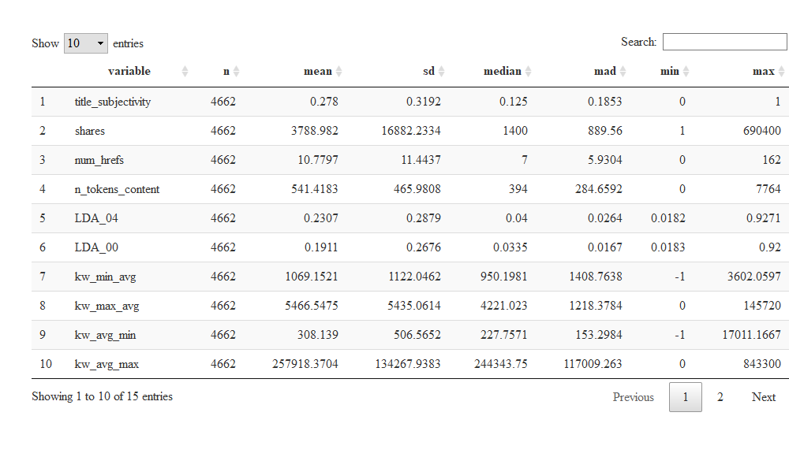

Weekday
================
Zack Vaskalis
07/03/2020

  - [Introduction](#introduction)
      - [Information on Attributes for
        Analysis:](#information-on-attributes-for-analysis)
  - [Data](#data)
  - [Summarizations](#summarizations)
  - [Modeling](#modeling)

## Introduction

This project uses, for analysis, the Online News Popularity Data Set
which can be found at the University of California Irvine [UCI Machine
Learning Repository, Center for Machine Learning and Intelligent
Systems](https://archive.ics.uci.edu/ml/datasets/Online+News+Popularity#).
The dataset being used here was compiled by several researchers in
Portugal, who collected articles from [Mashable](www.mashable.com) and
compiled associated statistics for a period of two years, with the goal
of being able to predict the number of shares in social networks (a
measure of popularity). The dataset has over 39,000 records of
information spanning the two year time period from January 07, 2013 to
December 27th, 2014. The dataset also contains 61 variables, of which 58
are predictive attributes, 2 non-predictive variables(the source url and
the time between article publication and dataset acquisition), and
finally the goal field for prediction: the number of shares.

### Information on Attributes for Analysis:

Out of the 61 Attributes available in this dataset for analysis, in
order not to overfit the model with too many dependent variables (which
could yield not enough generalization of the dataset to make
predictions, especially valid ones), I have chosen to use the following
14 predictor variables and of course the 1 outcome variable we are
trying to predict, `shares`. The weekday variables are also included,
but only for subsetting the data by the day of the week. Once we have
the “Monday” dataset, for instance, all of these `weekday_is_*`
variables will be removed from the dataset. The variables selected are
below, and the reasoning behind their selection follows.

Attribute Information:  
1\. `n_tokens_content`: Number of words in the content  
2\. `num_hrefs`: Number of links  
3\. `average_token_length`: Average length of the words in the content  
4\. `kw_avg_min`: Worst keyword (avg. shares)  
5\. `kw_avg_max`: Best keyword (avg. shares)  
6\. `kw_min_avg`: Avg. keyword (min. shares)  
7\. `kw_max_avg`: Avg. keyword (max. shares)  
8\. `kw_avg_avg`: Avg. keyword (avg. shares)  
9\. `LDA_00`: Closeness to LDA topic 0  
10\. `LDA_04`: Closeness to LDA topic 4  
11\. `global_subjectivity`: Text subjectivity  
12\. `global_sentiment_polarity`: Text sentiment polarity  
13\. `title_subjectivity`: Title subjectivity  
14\. `abs_title_subjectivity`: Absolute subjectivity level  
15\. `shares`: Number of shares (target outcome trying to predict)  
16\. `weekday_is_variables`: Was the article published on a
\_\_\_\_\_\_\_?

  - `weekday_is_monday`: Was the article published on a Monday?  
  - `weekday_is_tuesday`: Was the article published on a Tuesday?  
  - `weekday_is_wednesday`: Was the article published on a Wednesday?  
  - `weekday_is_thursday`: Was the article published on a Thursday?  
  - `weekday_is_friday`: Was the article published on a Friday?  
  - `weekday_is_saturday`: Was the article published on a Saturday?  
  - `weekday_is_sunday`: Was the article published on a Sunday?

For this dataset of nearly 60 predictor variables, a dataset for
analysis that contains approximately 25% of them seems to feel right,
since too many predictor variables can cause overfitting. This subset of
variables is a sampling across the set of variables I thought might have
an impact. For example, the number of words of content
(`n_tokens_content`), and the number of links (`num_hrefs`) seemed
reasonable that they might play a role in predicting shares. The `kw_`
variables also seem like they should be good predictors. I chose the
first and last `LDA` variables. The global ratings also seemed like they
would have an impact on predicting the shares so I chose
`global_subjectivity` and `global_sentiment_polarity`. Then finally, to
round out the dataset of predictors I chose the title subjectivity and
absolutely subjectivity level, since often a title will have the largest
impact - catchy or provoking titles are clickbait for a reason\!

## Data

Now on to the data\! First we will load in all of the necessary packages
from R.

``` r
#load necessary libraries
library(rmarkdown)
library(tidyverse)
library(caret)
library(lattice)
library(ggplot2)
library(dplyr)
library(haven)
library(rgl)
library(knitr)
library(tree)
library(randomForest)
library(psych)
library(DT)
library(summarytools)
```

Next we will read in the entire dataset. Then we will use the `select()`
function from the `dplyr` package to select only the variables mentioned
above for the analysis.

``` r
# Read-in entire dataset
path <- "C:/Users/Zachary Vaskalis/Dropbox/ST558/OnlineNewsPopularity.csv"
weekdayDataRAW <- read_csv(path)

# Select only variables I am choosing to use for the analysis.
weekdayData1 <- select(weekdayDataRAW, n_tokens_content, num_hrefs,
                       average_token_length, kw_avg_min, kw_avg_max,
                       kw_min_avg ,kw_max_avg, kw_avg_avg,
                       LDA_00, LDA_04,global_subjectivity,
                       global_sentiment_polarity, title_subjectivity,
                       abs_title_subjectivity, shares,
                       weekday_is_monday, weekday_is_tuesday,
                       weekday_is_wednesday, weekday_is_thursday, weekday_is_friday,
                       weekday_is_saturday, weekday_is_sunday,)

# Select only the specific day of the week I am interested in.
weekdayData2 <- filter(weekdayData1, weekday_is_monday == 1)

# Now we know we only have the day of the week filtered by above.
# So, we can remove all of the weekday_is_* variables now as they are no longer needed.
# Additionally, these variables are constant.  The selected weekday would contain all 1s,
# while the other weekdays are all 0s.  Thus, they are no longer useful for analysis.
weekdayData3 <- select(weekdayData2, -(weekday_is_monday:weekday_is_sunday))
```

``` r
# Get random number from the computer clock using Sys.time()
initial_seed <- Sys.time()
initial_seed <- as.integer(initial_seed)
print (initial_seed)
```

    ## [1] 1593791903

``` r
seed <- initial_seed %% 100000
#print(seed)

# -----------------RUN FROM HERE NOW THAT YOU HAVE RANDOM SEED-------------------------
# For reproducability, set seed using outcome of above process:
set.seed(42131)

# Get random sample of row numbers from large dataset to split data into train and test:
# 70% of data for training
train <- sample(1:nrow(weekdayData3), size = nrow(weekdayData3)*.70) 
# 30% of data for testing
test <- dplyr::setdiff(1:nrow(weekdayData3), train)

# Subset the Data into training and testing sets, using rows from train and test:
trainingData <- weekdayData3[train,]
testingData <- weekdayData3[test,]
```

## Summarizations

The summaries below are related to the training dataset. The table that
appears below is a summary of all of the variables from the training
dataset using the `describeBy()` function from the `psych` package.

``` r
# Summary statistics for all variables in the training dataset using the
# describeBy() function from the psych package
summaryData <- psych::describeBy(trainingData, trainingData$type)

x <- tibble(row.names(summaryData), summaryData) 
colnames(x)[1] <- "variable"
x[,4:10] <- round(x[,4:10],4)
y <- select(x,1,3,4,5,6,8,9,10)
datatable(arrange(y,desc(variable)))
```

<!-- -->

``` r
#histogram(trainingData$n_tokens_content)
#plot(trainingData$n_tokens_content,trainingData$shares)
#plot(trainingData$n_tokens_title,trainingData$shares)
#plot(trainingData$n_unique_tokens,trainingData$shares)
#plot(trainingData$global_subjectivity,trainingData$shares)


#trainingData$n_tokens_content <- log(trainingData$n_tokens_content + 1)
#trainingData$shares <- log(trainingData$shares + 1)

#trainingData <- filter(trainingData, n_tokens_content > 0)
```

## Modeling

``` r
# Multiple Regression Model chosen using all 20 predictor variables to try to predict
# shares.  This will also allow for comparison to the random forest model, and RMSE 
# values will be compared between the two models.

mlr1 <- lm(shares ~ ., data = trainingData)
summary(mlr1)
```

    ## 
    ## Call:
    ## lm(formula = shares ~ ., data = trainingData)
    ## 
    ## Residuals:
    ##    Min     1Q Median     3Q    Max 
    ## -26289  -2966  -1540      8 680009 
    ## 
    ## Coefficients:
    ##                             Estimate Std. Error t value Pr(>|t|)    
    ## (Intercept)               -2.512e+03  1.937e+03  -1.297  0.19477    
    ## n_tokens_content          -2.390e-01  6.081e-01  -0.393  0.69433    
    ## num_hrefs                  1.540e+01  2.541e+01   0.606  0.54458    
    ## average_token_length      -7.792e+02  3.918e+02  -1.989  0.04679 *  
    ## kw_avg_min                 1.026e+00  5.726e-01   1.791  0.07331 .  
    ## kw_avg_max                -2.993e-03  2.442e-03  -1.226  0.22040    
    ## kw_min_avg                -3.824e-01  2.910e-01  -1.314  0.18892    
    ## kw_max_avg                -2.770e-01  9.114e-02  -3.040  0.00238 ** 
    ## kw_avg_avg                 2.618e+00  4.935e-01   5.305 1.18e-07 ***
    ## LDA_00                     2.359e+03  9.914e+02   2.379  0.01739 *  
    ## LDA_04                    -9.756e+01  9.165e+02  -0.106  0.91523    
    ## global_subjectivity        8.965e+03  2.833e+03   3.164  0.00156 ** 
    ## global_sentiment_polarity -4.809e+03  2.737e+03  -1.757  0.07900 .  
    ## title_subjectivity        -2.429e+02  9.099e+02  -0.267  0.78952    
    ## abs_title_subjectivity     1.319e+03  1.502e+03   0.878  0.37997    
    ## ---
    ## Signif. codes:  0 '***' 0.001 '**' 0.01 '*' 0.05 '.' 0.1 ' ' 1
    ## 
    ## Residual standard error: 16740 on 4647 degrees of freedom
    ## Multiple R-squared:  0.02022,    Adjusted R-squared:  0.01727 
    ## F-statistic:  6.85 on 14 and 4647 DF,  p-value: 4.19e-14

``` r
trCtrl <- trainControl(method = "cv", number = 10)
mlr2 <- train(shares~., data=trainingData, method="lm",metric = "RMSE", trControl=trCtrl)
mlr2
```

    ## Linear Regression 
    ## 
    ## 4662 samples
    ##   14 predictor
    ## 
    ## No pre-processing
    ## Resampling: Cross-Validated (10 fold) 
    ## Summary of sample sizes: 4195, 4196, 4195, 4197, 4195, 4196, ... 
    ## Resampling results:
    ## 
    ##   RMSE      Rsquared    MAE     
    ##   14206.79  0.02379214  3972.618
    ## 
    ## Tuning parameter 'intercept' was held constant at a value of TRUE

The non-linear model chosen for this project is the random forests
model. This model is a good fit for this dataset given the number of
predictors included for analysis. In the model, a random subset of
predictors is selected, which will allow for a good predictor to not
dominate the tree fits. We will specify `mtry` to have a value of `p/3`.

``` r
# Non-linear model chosen is Random Forests Model  

# Model fit with training data
#rfFit <- randomForest(shares ~ ., data = trainingData, mtry = ncol(trainingData)/3,
#                     importance = TRUE)
# Fit Random Forest Tree using method = "rf" and tuning parameter, mtry
#trCtrl <- trainControl(method = "cv", number = 3)
#randFrst <- train(shares~., data = trainingData, method = "rf", trControl = trCtrl)
#randFrst


# Model predictions using testing data
#rfPred <- predict(rfFit, newdata = dplyr::select(testingData, -shares))

# Get the root mean squared error (RMSE) value - root of test prediction error

#rfRMSE <- sqrt(mean((rfPred-testingData$shares)^2))
#rfRMSE
```
